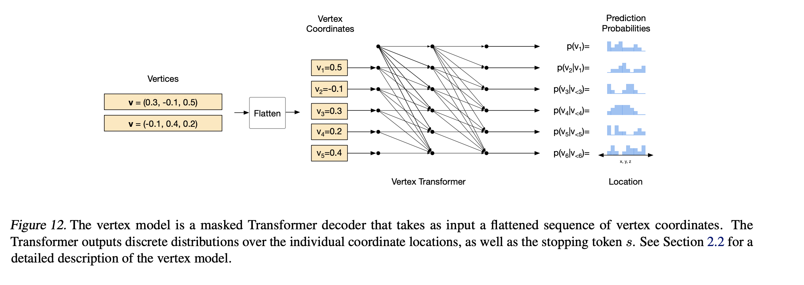
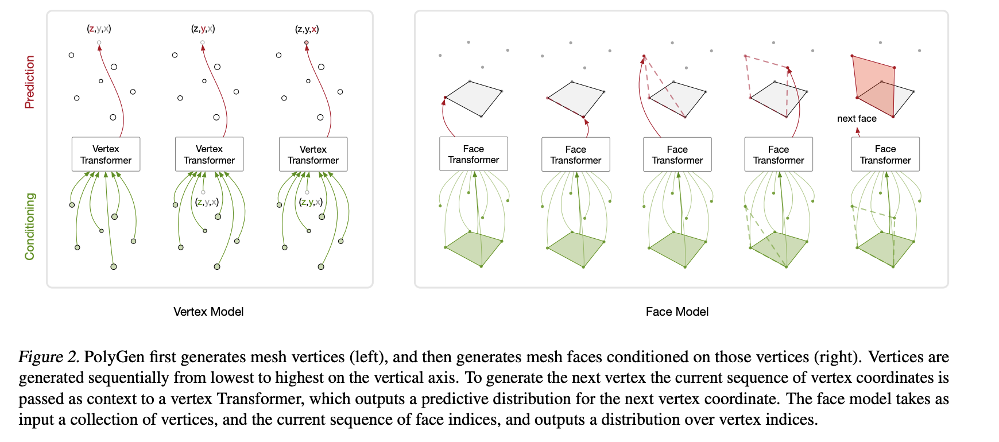

# A Pytorch Implementation of Polygen: An Autoregressive Generative Model of 3D Meshes

## Description

Polygen is a transformer-based model for generating 3D meshes from various contexts. In the paper, the authors generate 3D models from class-labels,
images and voxel-based representations of images. In this implementation, my main interest was generating 3D models from images, so I focused on
building out the class-conditioned mesh generation as a proof of concept and then the image-conditioned mesh generation. Polygen is composed of two models:
The vertex model and the face model. 

### Vertex Model

For both models, there is a different procedure for training the model and then sampling from the model. During training, the vertex model outputs a categorical
distribution over the quantized vertices of a batch of objects. The loss is then calculated as a negative log-likelihood calculation between the ground
truth vertices and the probabilities outputted by the distribution for the ground truth vertices.

During sampling, the model receives the context which can be either the class labels or images representing the meshes. It then autoregressively generates
the vertices coordinate by coordinate until it generates a stopping token or the max sequence length has been reached. 


<figcaption align="center"><b>Forward pass of vertex model training procedure from <a href="https://arxiv.org/pdf/2002.10880.pdf">Polygen</a></b></figcaption>
<br></br>

### Face Model
The face model is primarily conditioned on vertices, while it can be conditioned on class-labels, in this implementation we only condition it on dequantized
vertices. Faces are represented as sequences of vertex indices in which two indices next to one another represent connectivity between those two vertices. 
During training, the face model outputs a categorical distribution over all vertex indices and the loss is calculated with a negative log-likelihood,
similar to the vertex model.

During sampling, the model receives a batch of vertices and the associated vertex masks and then autoregressively generates vertex indices until it generates 
a stopping token or the max sequence length has been reached. 


<figcaption align="center"><b>Forward pass of face model training procedure from <a href="https://arxiv.org/pdf/2002.10880.pdf">Polygen</a></b></figcaption>
<br></br>

### Inference Procedure
When trying to generate meshes that are not in the shapenet dataset, we feed the context (usually a batch of images) into the vertex model which then autoregressively samples the vertices. We then feed those vertices into the sampling method of the face model which proceeds to generate a set of faces for the given vertices. It would be interesting to experiment if adding image context to the face model could improve the the sampling of the faces.


<figcaption align="center">Joint sampling procedure from <a href="https://arxiv.org/pdf/2002.10880.pdf">Polygen</a></b></figcaption>
<br></br>

## Results

Due to compute limits, I train on toy datasets for proof of concept and on different subsets of the shapenet dataset. For results on the toy datasets
check out the pdfs in the main directory ```sample_class_condition_train.pdf``` and ```sample_image_condition_train.pdf```. The models for
the subsets of shapenets are currently being trained and I will upload some of the meshes that they generate once they are done.


## Citations

```
@article{nash2020polygen,
  author={Charlie Nash and Yaroslav Ganin and S. M. Ali Eslami and Peter W. Battaglia},
  title={PolyGen: An Autoregressive Generative Model of 3D Meshes},
  journal={ICML},
  year={2020}
}
```
